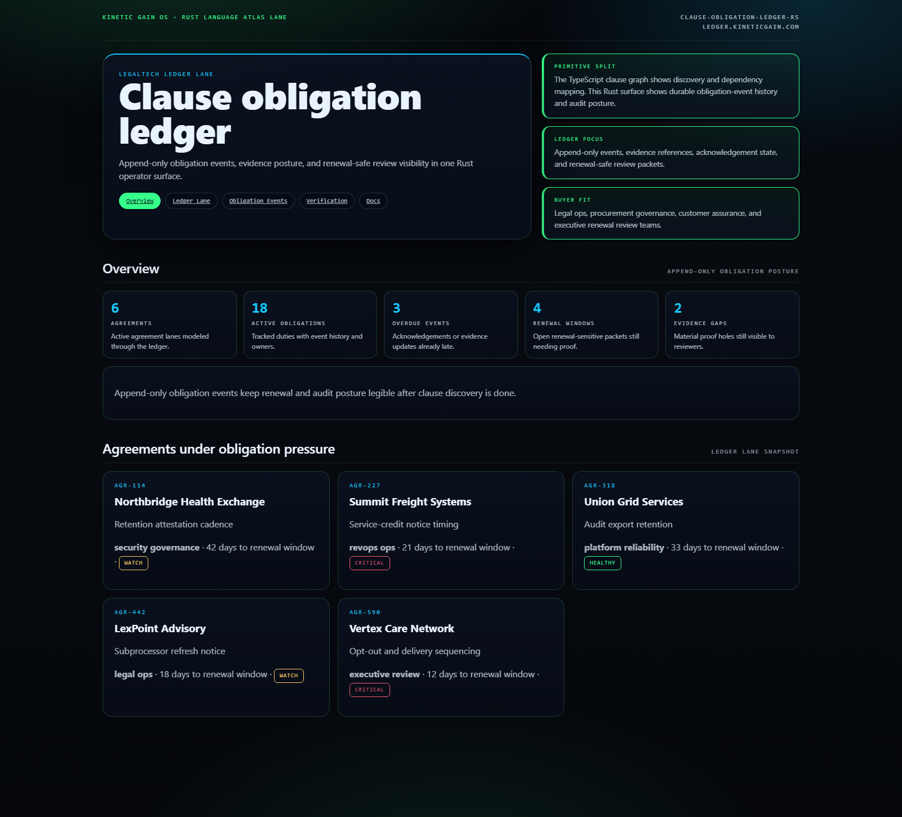
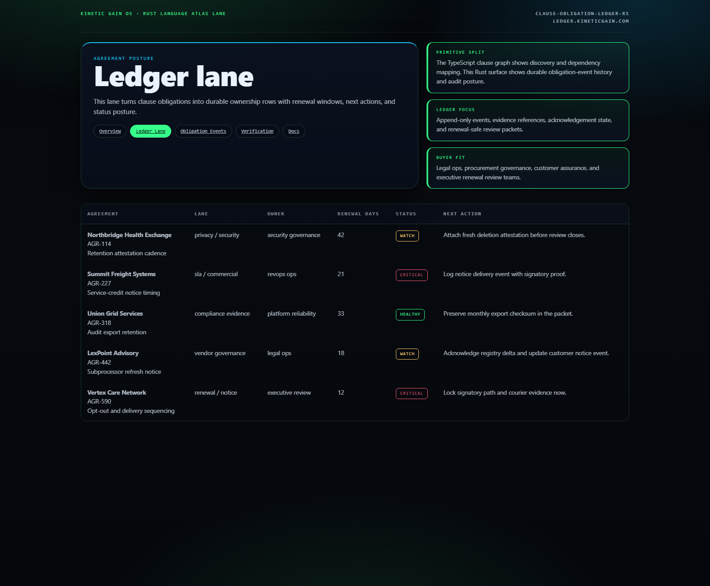
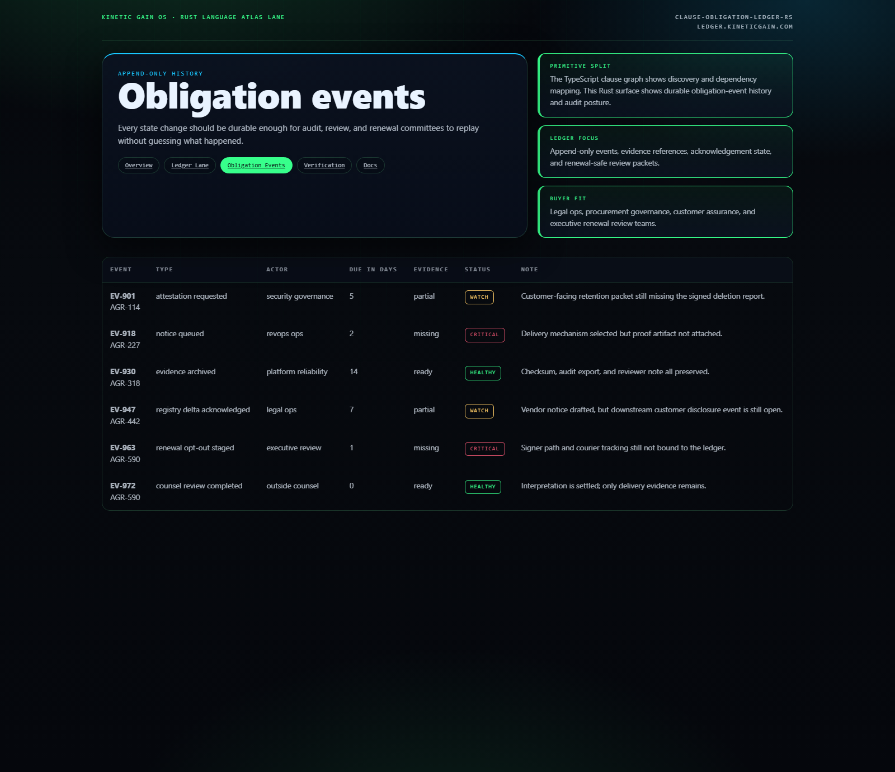
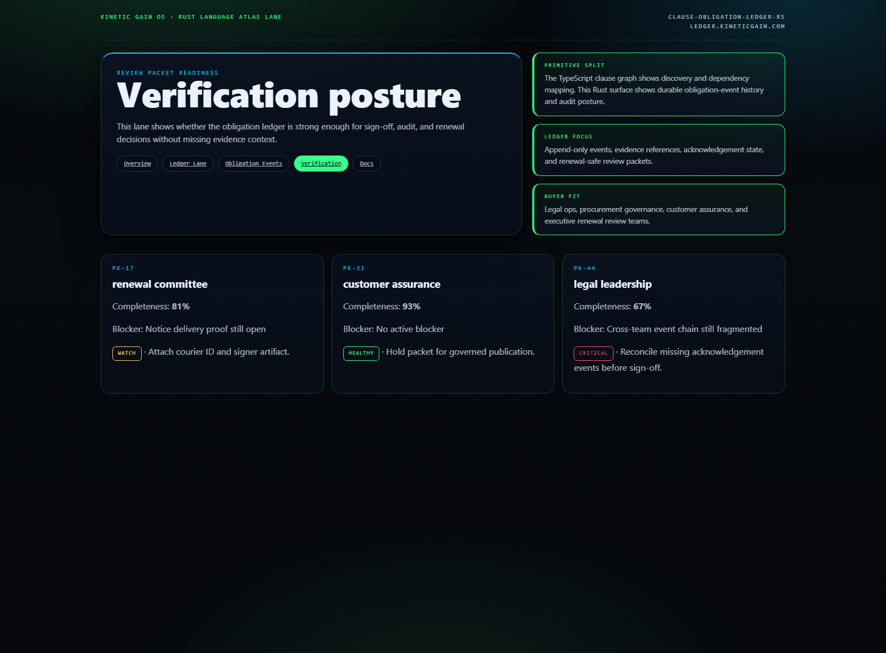

# Clause Obligation Ledger RS

[](https://github.com/mizcausevic-dev/clause-obligation-ledger-rs/actions/workflows/ci.yml)
[](./LICENSE)
[](https://github.com/mizcausevic-dev/clause-obligation-ledger-rs/actions/workflows/pages.yml)

Rust control plane for clause obligation ledgers, append-only review events, evidence posture, and renewal-safe execution across enterprise agreements.

## Why this exists

- Clause extraction is only half the job. Legal and procurement teams still need a durable event record showing what obligation changed, who acknowledged it, what evidence exists, and what remains blocked.
- Renewal, notice, and disclosure failures usually happen in the handoff between clause understanding and operational follow-through.
- High-trust teams need an append-only obligation ledger that can feed dashboards, reviews, and audit packets without turning the contract system into a write-heavy workflow hazard.

## Why this matters (KG Embedded tie-back)

This repo demonstrates the obligation-ledger primitive for LegalTech buyers: append-only events, evidence posture, review gating, and renewal pressure in one Rust operator surface. It complements [contract-clause-obligation-graph](https://clauses.kineticgain.com/) by focusing on audit-safe event history instead of clause discovery alone. Kinetic Gain Embedded extends this into security-first in-product analytics for obligation-aware customer operations, account health, and review workflows, see [kineticgain.com/embedded](https://kineticgain.com/embedded).

## Routes

- `/`
- `/ledger-lane`
- `/obligation-events`
- `/verification`
- `/docs`

## API

- `/api/dashboard/summary`
- `/api/ledger-lane`
- `/api/obligation-events`
- `/api/verification`
- `/api/sample`

## Screenshots






## Local development

```powershell
cd clause-obligation-ledger-rs
cargo run
```

Open:
- [http://127.0.0.1:5532/](http://127.0.0.1:5532/)
- [http://127.0.0.1:5532/ledger-lane](http://127.0.0.1:5532/ledger-lane)
- [http://127.0.0.1:5532/obligation-events](http://127.0.0.1:5532/obligation-events)
- [http://127.0.0.1:5532/verification](http://127.0.0.1:5532/verification)

## Validation

- `cargo test`
- `cargo build`
- `cargo run --bin prerender`
- `cargo run --bin demo`
- `cargo run --bin smoke`
- `powershell -ExecutionPolicy Bypass -File .\scripts\render_readme_assets.ps1`

## Production status

| Aspect | Status |
|--------|--------|
| CI | Rust build · tests · prerender · demo · smoke ([workflow](./.github/workflows/ci.yml)) |
| Test coverage | Example core coverage with expansion path for parser and event reducers |
| License | [AGPL-3.0-or-later](./LICENSE) |
| Security | [SECURITY.md](./SECURITY.md) |
| Deploy | Static prerender → **https://ledger.kineticgain.com/** (GitHub Pages, [pages workflow](./.github/workflows/pages.yml)) |

## Docs

- [Architecture](./docs/architecture.md)
- [Origin](./docs/ORIGIN.md)
- [Kinetic Gain Embedded tie-back](./docs/KINETIC_GAIN_EMBEDDED.md)
- [Changelog](./CHANGELOG.md)

## Part of the Kinetic Gain Suite

Operator surface in the [Kinetic Gain Suite](https://suite.kineticgain.com/) — a portfolio of buyer-readable control planes spanning security posture, compliance evidence, data-platform governance, FinOps, and operator workflows. See the suite index for related surfaces. Apex: [kineticgain.com](https://kineticgain.com/).
